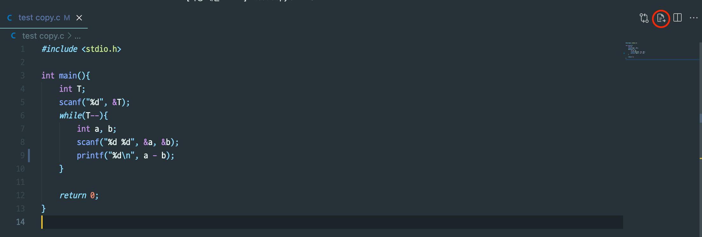
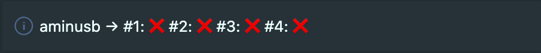
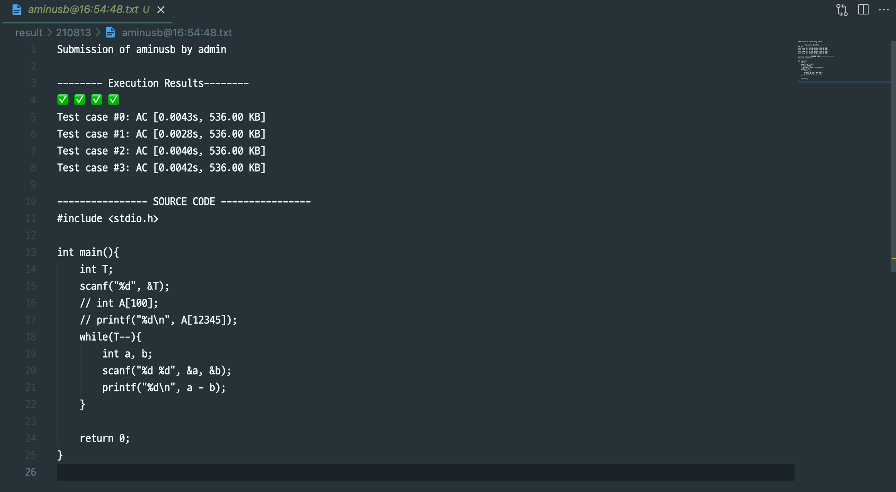
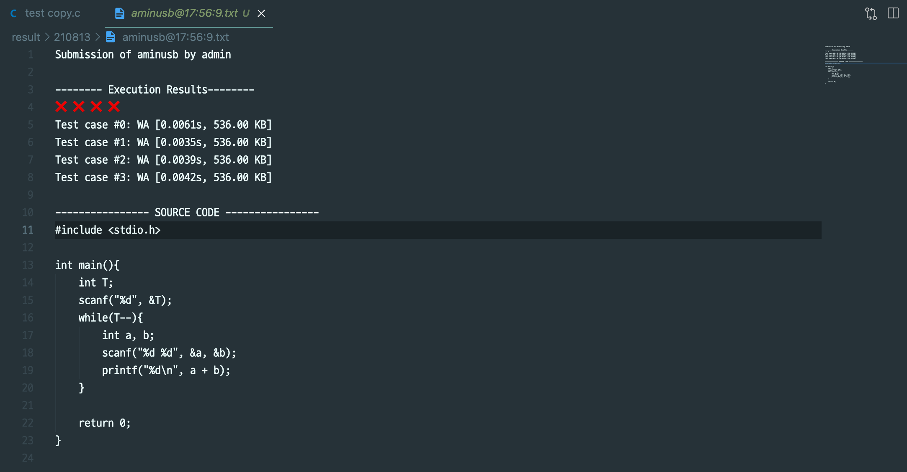
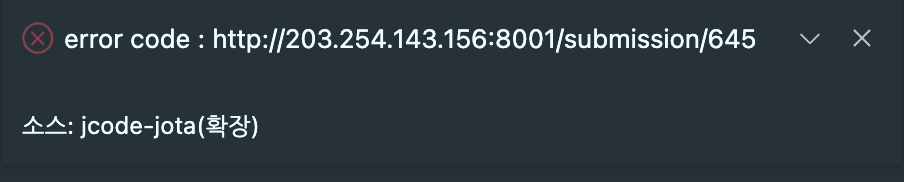

# JCode-Jota

## Description

JCode에서 작성한 코드를 JOTA로 바로 제출하고, 결과를 받아볼 수 있는 vscode-extension.

## Enviroment

**node**: 14.15.4  
**npm**: 7.20.2  
**vscode**: ^1.57.0

## Prerequisite

node, npm이 정상적으로 설치되어있을 때

- Vscode Extension 개발을 위해 `npm install -g yo generator-code vsce` 를 실행
- 프로젝트 폴더 내에서 `npm install` 을 실행하여 필요한 modules를 다운로드

## Usage

### Submit

- 그림에 표시된 아이콘을 클릭하여 소스코드를 제출
  

- 처음 제출 시 유저의 아이디를 초기화
  

- 제출할 문제 코드를 입력  
  

_두번째 제출부터는 유저의 아이디를 묻지 않고 문제 코드만 입력_

### 유저의 정보 저장

- 유저가 입력한 정보 (ID, 최근 제출한 문제) 는 `.jcode-jota/submitMeta.json`에 다음과 같이 저장

**submitMeta.json 파일이 없다면 유저의 정보를 처음부터 다시 물어봄**


```JSON
//.jcode-jota/submitMeta.json
{
  "userID": "admin",
  "currentSubmit": "aminusb"
}
```

### 정상적인 제출 결과

- 제출 결과

  - 정답
    
  - 오답
    

- 제출 결과를 텍스트 파일로 result 폴더에  
  `result/제출 날짜/{제출 문제 코드}@{제출 시각}.txt` 의 형식으로 저장
  

- 텍스트 파일 구성
  - 정답
    
  - 오답
    

## 비정상적인 제출 결과

**status code를 405로 받으면 오류라고 판단**

- userID/problemCode 오류  
  존재하지 않는 유저 ID 또는 존재하지 않는 문제 코드를 제출시
   그림과 같이 에러메세지 출력

- 그 외 오류 (CE, TLE, RTE ...)  
  자세한 정보를 확인할 수 있도록 제출 결과의 주소(Jota) 의 주소를 반환

  

## REST API

### Request

```
# REST를 보낼 URL 정보 -> 테스트용 서버, Jota로 전환 필요
HOST: http://203.254.143.156:8001
PATH: /api/v2/submit/jcode
```

```JSON
// 서버로 채점을 요청할 때의 형식
{
    "method": "POST",
    "body":
        {
            "judge_id": "jota-judge",
            "language": "C",
            "user": "user's ID",
            "problem": "target problemCode",
            "source": "user's sourceCode",
        },
    "headers": {
        "Content-type": "application/json",
    }
}

```

### Response

```
# 서버에서 채점 결과를 보내주는 형식
[[Result, Time, Memory]...] # test Case의 수만큼 배열 형식으로 반환
```

### Sample

Request

```ts
//body
const data = {
  judge_id: 'jota-judge',
  language: 'C',
  user: 'admin',
  problem: 'aplusb',
  source: 'sourceCode',
};

const options = {
  method: 'POST',
  body: JSON.stringify(data),
  headers: {
    'Content-type': 'application/json',
  },
};

const response = await fetch(URL, options); //request
```

Response

```ts
//if success
[
  ['AC', 0.00127283, 536],
  ['AC', 0.01239603, 536],
  ['AC', 0.00382931, 536],
];
//if error
...
```
